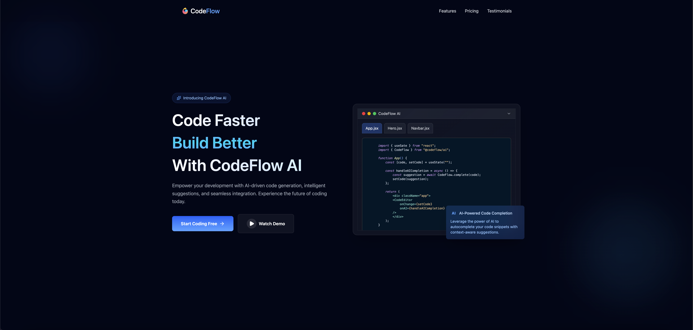

# New Personal Website

Minimal personal website built with React + Vite and styled with Tailwind CSS. Includes reusable components (Navbar, Hero, Features, Pricing, Testimonials, Footer) and example data.

## 🚀 Live Demo

[Click here to view the live demo](https://tourmaline-froyo-f10715.netlify.app/)



## Quick start

Requirements:

- Node.js 16+ / npm (macOS)

Install and run locally:

```sh
# install dependencies
npm install

# start dev server
npm run dev

# build for production
npm run build

# preview production build locally
npm run preview
```

## Project structure

- src/

  - App.jsx — main app
  - main.jsx — app entry
  - index.css — Tailwind + global styles
  - components/
    - Navbar.jsx
    - Hero.jsx
    - Features.jsx
    - Pricing.jsx
    - Testimonials.jsx
    - Footer.jsx
  - data/
    - CodeExample.js — example/demo data

- index.html — Vite HTML entry
- package.json — scripts & deps
- vite.config.js — Vite config

## Features

- Vite-powered React app for fast dev builds
- Tailwind CSS utility-first styling
- Lucide icons used across components
- Responsive layout with accessible markup


